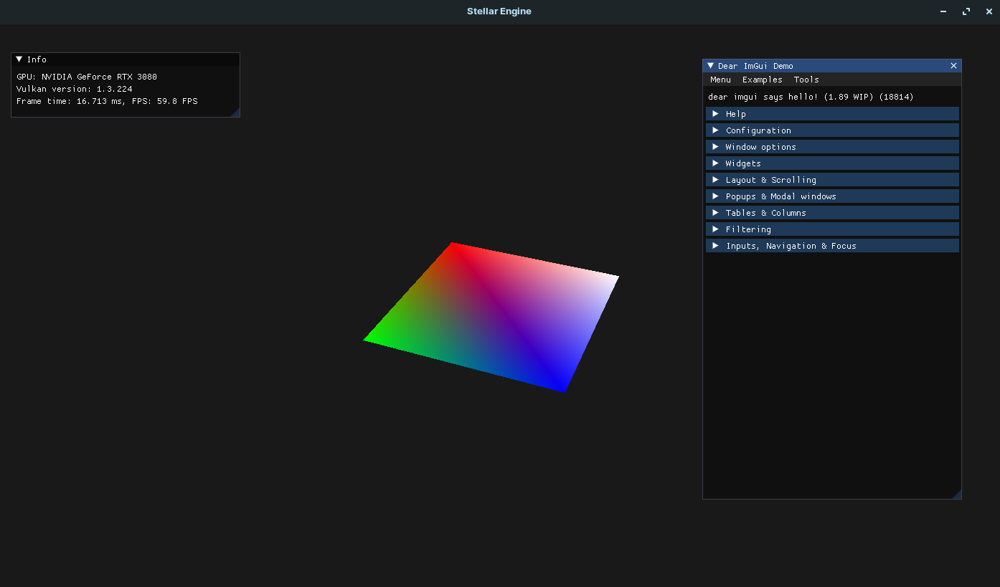

# Stellar Engine
A custom game engine using C++ and Vulkan/Metal API.
## Table of Contents
* [Introduction](#introduction)
* [Installation](#installation)
* [ToDo](#todo)

## Introduction
Stellar Engine is a cross-platform game engine using Vulkan/Metal API. Inspired by Cherno's [Hazel Engine](https://github.com/TheCherno/Hazel)

Currently it is at the very initial state of development. It supports Windows10(64 bit), Linux(64 bit) and macOS. 
> On Windows and Linux platforms, StellarEngine will use Vulkan API.
> And on macOS, it will use Metal API instead.

### How it works

This project has 2 sub projects, the `core engine` and a `sandbox`. The `core engine` contains all the rendering code, and the `sandbox` can be viewed as a client(a game or a 3D application).

- On Windows and Linux platform, code is written purely in C++, and is compiled using `g++`. 
> Note: On Windows you will need to install `MinGW` first, see [here](#installation) for detail.

- On macOS, code is written in C++ and Objective-C++, with the latter primarily being a bridging file between the main C++ code and [metal-cpp](https://developer.apple.com/metal/cpp/) code.

- All three platforms use `GLFW` as window creation and `ImGui` for UI components.

### Current Stage

## Installation

### Prerequisite

I will try to list as detailed as possible. However I have not tested the build on a fresh envrionment so you are welcomed to try it and provide some feedback.

- [Vulkan](https://vulkan.lunarg.com/)
    - [Windows](https://vulkan.lunarg.com/doc/sdk/latest/windows/getting_started.html)
    - [macOS](https://vulkan.lunarg.com/doc/sdk/latest/mac/getting_started.html)
    - [Linux](https://vulkan.lunarg.com/doc/view/latest/linux/getting_started_ubuntu.html)
- Follow the Development Environment Tutorial (https://vulkan-tutorial.com/Development_environment)
- C++17
- Windows:
    - MinGW with GCC installed
    - Follow tutorial here: https://www.msys2.org/
- Linux:
    - GNU GCC
    - X11
- macOS:
    - Clang++
> Note: On maoOS, if you want to enable `Address Sanitation(Valgrind)` you need to manually install clang from llvm as the default clang in `/usr/bin` shipped by Apple does not support it.

### Running

To run in debug mode, use: 

`make -j BUILD=debug`

Then, run the executable:

`make run BUILD=debug`

To run in release, simply `make -j; make run`

## ToDo

- [x] Window abstraction
- [x] Layer
- [x] Events
- [x] ImGui
- [x] Triangle
- [x] Shader library
- [x] Camera
- [ ] Texture
- [x] Renderer
- [x] Metal-cpp
- [x] macOS support
- [ ] Load model
- [ ] PBR
- [ ] IBL
- [ ] Deferred rendering
- [ ] Memory allocator
- [ ] Multi-threading