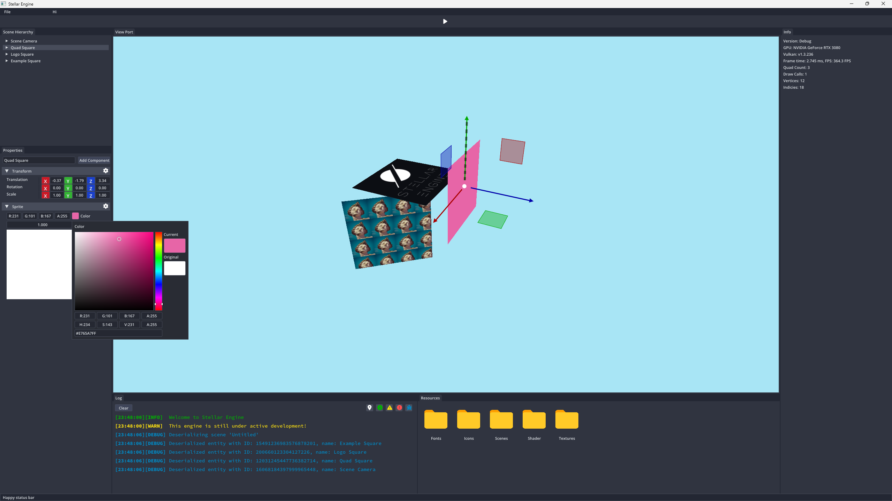

# Stellar Engine

A custom game engine using C++ and Vulkan/Metal API.

## Table of Contents

- [Stellar Engine](#stellar-engine)
	- [Table of Contents](#table-of-contents)
	- [Introduction](#introduction)
		- [How it works](#how-it-works)
		- [Current Stage](#current-stage)
	- [Dependencies](#dependencies)
		- [GLFW](#glfw)
		- [GLM](#glm)
			- [glm](#glm-1)
			- [simd](#simd)
		- [ImGui](#imgui)
		- [Metal-cpp](#metal-cpp)
		- [spdlog](#spdlog)
	- [Installation](#installation)
		- [Prerequisite](#prerequisite)
		- [Running](#running)
			- [From Command Line](#from-command-line)
			- [From VS-Code](#from-vs-code)
			- [From Xcode](#from-xcode)
	- [ToDo](#todo)

## Introduction

Stellar Engine is a cross-platform game engine using Vulkan/Metal API. Inspired by Cherno's [Hazel Engine](https://github.com/TheCherno/Hazel)

Currently it is at the very initial state of development. It supports Windows10(64 bit), Linux(64 bit) and macOS.
> On Windows and Linux platforms, StellarEngine will use Vulkan API.
> And on macOS, it will use Metal API instead.

### How it works

This project has 2 sub projects, the `core engine` and a `sandbox`. The `core engine` contains all the rendering code, and the `sandbox` can be viewed as a client(a game or a 3D application).

| Platform      | Graphics API | Language          | Compiler  |
| ------------- | ------------ | ----------------- | --------- |
| Windows       | Vulkan       | C++               | g++       |
| Linux         | Vulkan       | C++               | g++       |
| Mac           | Metal        | C++/Objective-C++ | clang++   |

### Current Stage



## Dependencies

### GLFW

StellarEngine uses `GLFW` to create window on Windows, Linux and macOS.

### GLM

StellarEngine uses `glm` as main mathematics libray, including position vectors and camera transforms.
> Note: On macOS, Apple's `simd` has different memory alignment than standard `glm` alignments.

#### glm

| Data type   | Size | Alignment |
| ----------- | ---- | --------- |
| `glm::vec2` | 8    | 4         |
| `glm::vec3` | 12   | 4         |
| `glm::vec4` | 16   | 4         |
| `glm::mat4` | 64   | 4         |

#### simd

| Data type       | Size | Alignment |
| --------------- | ---- | --------- |
| `float2`        | 8    | 8         |
| `float3`        | 16   | 16        |
| `float4`        | 16   | 16        |
| `float4x4`      | 64   | 16        |
| `packed_float2` | 8    | 4         |
| `packed_float3` | 12   | 4         |
| `packed_float4` | 16   | 4         |

### ImGui

On windows and Linux, ImGui context will be Vulkan, and Metal on macOS.

### Metal-cpp

StellarEngine does not use MoltenVK, instead, it uses Metal directly. Metal-cpp is a C++ interface for Metal API.

### spdlog

StellarEngine uses `spdlog` for its core logging features. A wrapper is written to better organize its functions.

```c++
// core
STLR_CORE_TRACE("This is white text, {0}", example_arg)
STLR_CORE_INFO("This is green text, {0}", example_arg)
STLR_CORE_WARN("This is yellow text, {0}", example_arg)
STLR_CORE_ERROR("This is red text, {0}", example_arg)
STLR_CORE_FATAL("This is white text with red background, {0}", example_arg)

// client
STLR_TRACE("This is white text, {0}", example_arg)
STLR_INFO("This is green text, {0}", example_arg)
STLR_WARN("This is yellow text, {0}", example_arg)
STLR_ERROR("This is red text, {0}", example_arg)
STLR_FATAL("This is white text with red background, {0}", example_arg)
```

## Installation

### Prerequisite

I will try to list as detailed as possible. However I have not tested the build on a fresh envrionment so you are welcomed to try it and provide some feedback.

* [Vulkan](https://vulkan.lunarg.com/)
  * [Windows](https://vulkan.lunarg.com/doc/sdk/latest/windows/getting_started.html)
  * [macOS](https://vulkan.lunarg.com/doc/sdk/latest/mac/getting_started.html)
  * [Linux](https://vulkan.lunarg.com/doc/view/latest/linux/getting_started_ubuntu.html)

* Follow the Development Environment Tutorial (<https://vulkan-tutorial.com/Development_environment>)

* C++17
* Visual Studio Code (optional)
* CMake
* vkpkg
* Windows:
  * Visual Studio 2019
* Linux:
  * GNU GCC
  * X11
* macOS:
  * Xcode (optional)
  * Clang++
  * pkg-config
  
> Note: On macOS, if you want to enable `Address Sanitation(Valgrind)` you need to manually install clang from llvm as the default clang in `/usr/bin` shipped by Apple does not support it.

### Running

#### From Command Line

1. Create a build folder: `mkdir build && cd build`.
2. Configure the project: `cmake ..`.
	* On Windows, the default generator is Visual Studio.
	* On macOS, it is recommended to use Xcode as generator: `cmake .. -G Xcode`, as it provides Metal API Validation Layer. 
  	And depending on your platform, whether an M1 or Intel, append `-DCMAKE_OSX_ARCHITECTURES=x86_64 or arm64`.
3. Build the project: `cmake --build . --config Debug/Release`

#### From VS-Code

* Go to `Run and Debug`, select a configuration according to your platform, then hit F5.

#### From Xcode

After building the project using `cmake`, go to your build folder and open `StellarEngine.xcodeproj`.

Select `StellarEditor` from Scheme, then `CMD + R`.

## ToDo

* [x] Window abstraction
* [x] Layer
* [x] Events
* [x] ImGui
* [x] Triangle
* [x] Shader library
* [x] Camera
* [x] Texture
* [x] Renderer
* [x] Metal-cpp
* [x] macOS support
* [x] Better 2D renderer
* [ ] Load model
* [ ] PBR
* [ ] IBL
* [ ] Deferred rendering
* [ ] Memory allocator
* [ ] Multi-threading
